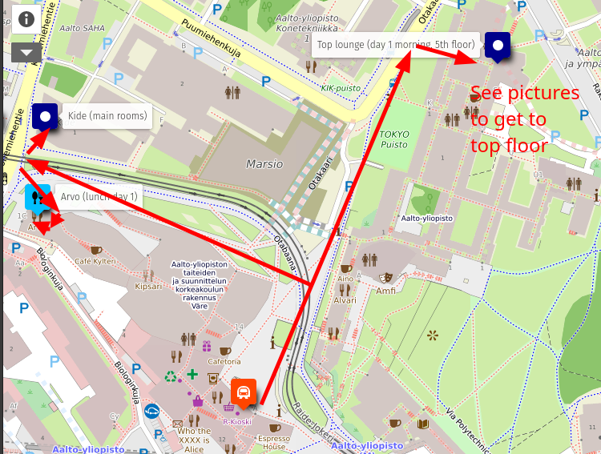
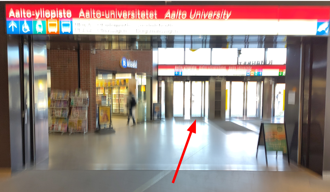
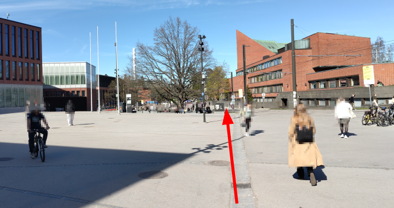
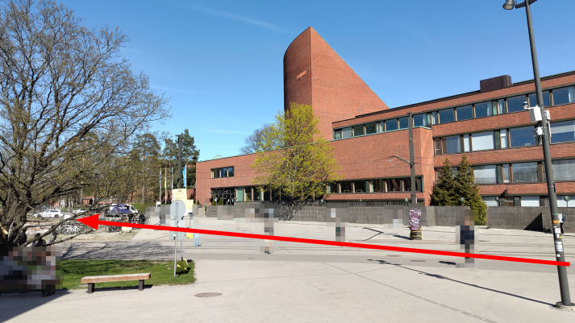
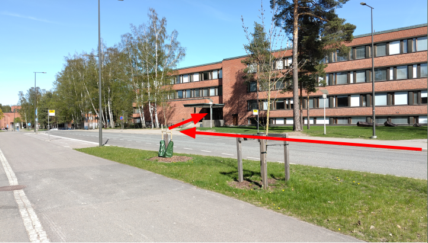
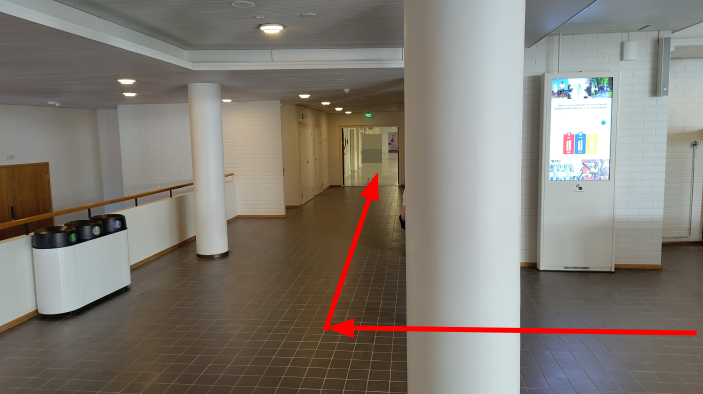
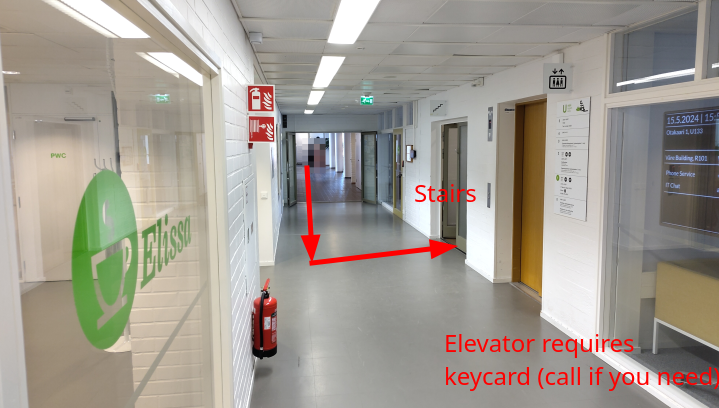
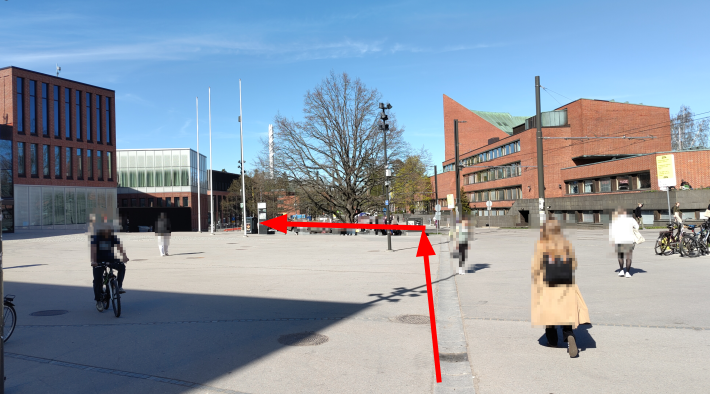
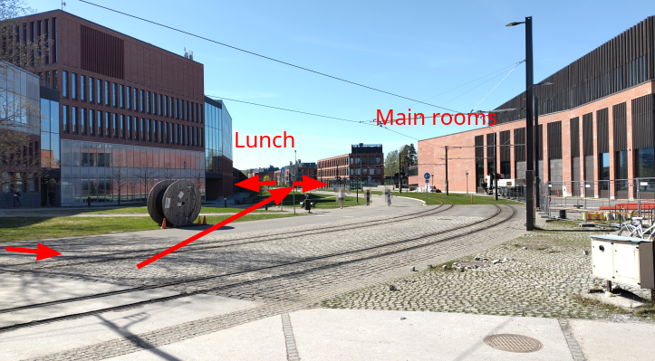
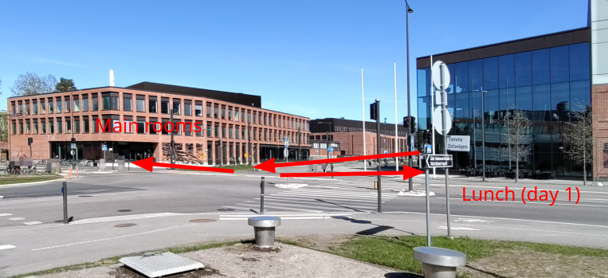

# Nordic-RSE conference directions

## Map
<iframe width="650px" height="400px" frameborder="0" allowfullscreen allow="geolocation" src="//umap.openstreetmap.fr/en/map/nordic-rse-2024_1014563?scaleControl=false&miniMap=false&scrollWheelZoom=false&zoomControl=true&editMode=disabled&moreControl=true&searchControl=null&tilelayersControl=null&embedControl=null&datalayersControl=null&onLoadPanel=none&captionBar=false&captionMenus=true&datalayers=8c66f524-5334-4945-ba10-2ba10b3b2eef%2C3dee9430-a454-459b-93c7-f579eafacdc6%2C7430a18e-daeb-4295-ae44-00abb6ec00c3#16/60.1865/24.8246"></iframe>
<a href="//umap.openstreetmap.fr/en/map/nordic-rse-2024_1014563?scaleControl=false&miniMap=false&scrollWheelZoom=true&zoomControl=true&editMode=disabled&moreControl=true&searchControl=null&tilelayersControl=null&embedControl=null&datalayersControl=null&onLoadPanel=none&captionBar=false&captionMenus=true&datalayers=8c66f524-5334-4945-ba10-2ba10b3b2eef%2C3dee9430-a454-459b-93c7-f579eafacdc6%2C7430a18e-daeb-4295-ae44-00abb6ec00c3#16/60.1865/24.8246">See full screen</a>

## Map, day 1 (image)

## Day 1, morning

### Out metro entrance **A**

### Towards the "main building" ("undergraduate center")

### Continue down the street past the main entrance
The main entrance can also get you there (and has an info desk to help you), but walking outside is probably nice.

### In the back entrance

It is entrance "M" (no one would call it this, though).

### TODO: walk straight in, towards the further corridor

### Down corridor
To the left (south).

### Take the stairs next to the cafe
Take the **stairs** up if possible.  Go to the 5th floor.  Knock on the locked door or call us and we will let you in.

The cafe is closed since forever, but is a good landmark.

### TODO: The "Top lounge" is right on the left.

It is clearly labeled on the double glass doors

## Day 1, main meeting rooms and lunch

### Leave the metro station (exit **A**) as before

### Head towards the left (west)

### Head down between the buildings (west)

### Main room and lunch are across from each other

